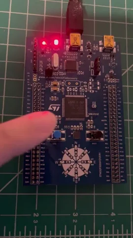
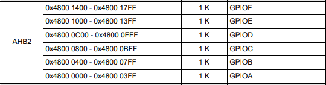
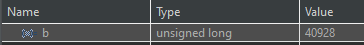
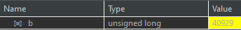

# Project 4

## Make Blinky Prompt
What are the hardware registers that cause the LED to turn on and off? (From the processor manual, don’t worry about initialization.) What are the button registers that you read? Can you read that memory directly and see the button change in a debugger or by printing out the associated memory?

## Make Blinky Answers
[stm32f303vc](https://www.st.com/resource/en/datasheet/stm32f303vc.pdf)

Looking at my memory map the built in LEDs use GPIOE so the address would be:
`0x4800 1000`
My button registers use GPIOA so the address would be: `0x4800 0000`

Adding a variable for the register shows the difference in the debugger of unpressed vs pressed:
`unsigned long b = (*(int*)(0x48000010));`

## File Definitions
### Main homework file
*main.c*

The main.c file is from my STMCube32IDE project. Using the `.ioc` file I set my timer and button as an interrupt which generated some of the code for me. Personal additions are called out below

**timerWithBoundsCheck**

Verify delay while handling rollover counter.

**updateLEDs**

My Microcontroller has 8 circular LEDs, I rotate between them.

**updateButtonState**

Handle updating hte button state if the press is after the defined delay period.

**HAL_GPIO_EXTI_Callback**

Interrupt callback function which updates the button state. Only toggle the button state to keep this function as short as possible and handle actual logic in the main process.